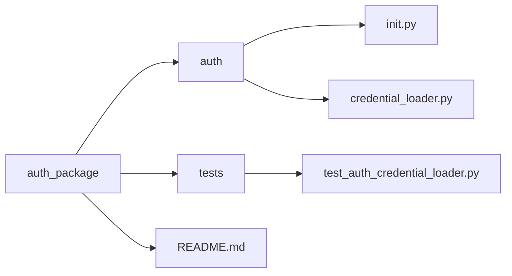

# Azure Authentication

This package provides a flexible authentication loader for Azure services. It supports reading credentials and configuration from a `.env` file or from system environment variables, based on the `AUTH_CREDENTIAL_MODE`.

## 📁 Folder Structure



## 🚀 Features
- Centralized credential resolution logic
- Supports .env and system environment variable modes
- Exception handling for missing or invalid values
- Easy integration with Azure SDKs


## 📦 Installation
Install dependencies:
```bash
pip install python-dotenv azure-identity
```

Then copy the auth package into your project directory.

## ⚙️ Configuration
Create a `.env` file in your project root:


```VisualBasic
AUTH_CREDENTIAL_MODE="env"  # or "system"

AZURE_TENANT_ID="your-tenant-id-or-env-var-name"
AZURE_CLIENT_ID="your-client-id-or-env-var-name"
AZURE_CLIENT_SECRET="your-client-secret-or-env-var-name"
AZURE_AI_PROJECT_ENDPOINT="your-project-endpoint-or-env-var-name"
AZURE_OPENAI_ENDPOINT="your-openai-endpoint-or-env-var-name"
AZURE_OPENAI_API_KEY="your-api-key-or-env-var-name"
AZURE_OPENAI_API_VERSION="your-api-version-or-env-var-name"
```

## 🧠 Mode Behavior
- `env`: Values in `.env` are used directly.
- `system`: Values in `.env` are treated as names of system environment variables, and their values are fetched from the system.


## 🧰 Usage Example

```python

from auth import AuthCredentialLoader

loader = AuthCredentialLoader(env_path=".env")

# Get Azure credentials
credentials = loader.get_credentials()

# Get AI Project endpoint
project_endpoint = loader.get_project_endpoint()

# Get OpenAI configuration
openai_config = loader.get_openai_config()

```

## 📄 License
This script is provided "as-is", without any express or implied warranty.
You are free to use, modify, and distribute this code at your own risk.
The author(s) shall not be held liable for any damages arising from the use of this software.
